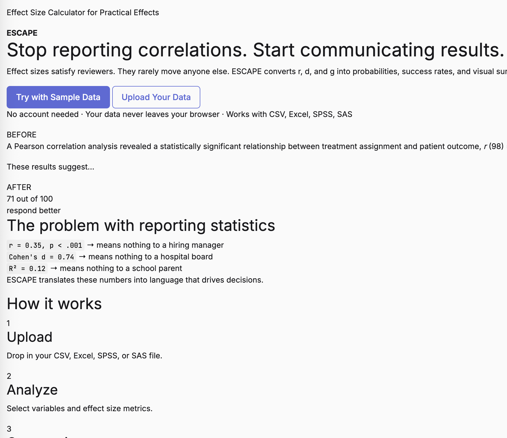
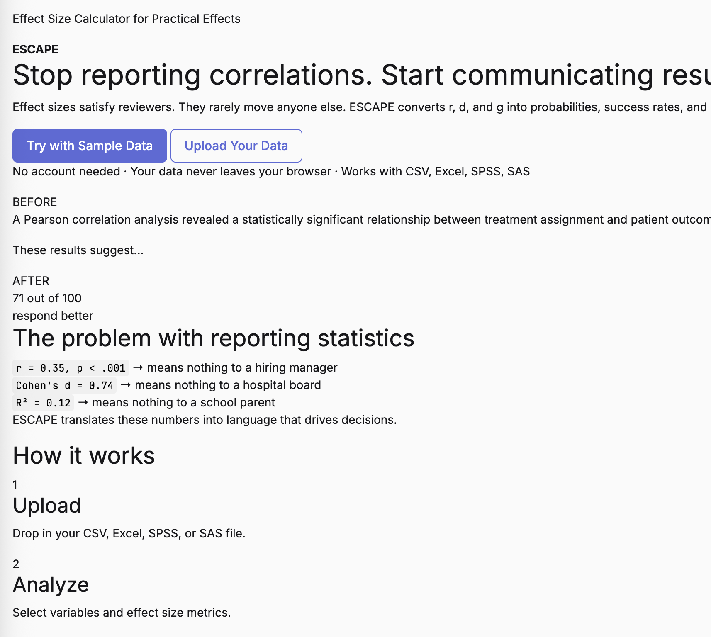

# AGENTS.md

Guidance for agentic coding agents working on ESCAPE — Effect Size Calculator for Practical Effects.

This is an R Shiny application that converts traditional effect sizes (r, d, g) into probabilities, success rates, and visual summaries.

Deployed at https://dczhang.shinyapps.io/shinyescape/

## Project Overview

- **Language**: R (Shiny framework using `bslib` for Bootstrap 5 theming)
- **Frontend**: HTML/CSS (custom `landing.css` + `main.css`), JS (`main.js`)
- **Structure**: Single-file Shiny app (`app.R`) with sourced utility modules in `R/`
- **Data**: Sample dataset at `data/sampleData.csv` (`vigorous_days_per_week`, `self_rated_health`; NHIS 2024 public-use adult sample, n=1000)

## Build & Run Commands

```bash
# Run locally
Rscript app.R

# Check R syntax (run for each modified R file)
Rscript -e "tryCatch(parse('app.R'), error=function(e) cat('ERROR:', e\$message, '\n')); cat('OK\n')"
Rscript -e "tryCatch(parse('R/utils_stats.R'), error=function(e) cat('ERROR:', e\$message, '\n')); cat('OK\n')"
Rscript -e "tryCatch(parse('R/utils_plots.R'), error=function(e) cat('ERROR:', e\$message, '\n')); cat('OK\n')"
Rscript -e "tryCatch(parse('R/utils_theme.R'), error=function(e) cat('ERROR:', e\$message, '\n')); cat('OK\n')"

# Check JS syntax
node -c www/js/main.js

# Deploy to shinyapps.io
Rscript -e "rsconnect::deployApp('.', appName='shinyescape', account='dczhang')"
```

## Tests

No formal test suite. Verify changes by:

1. Running `Rscript app.R` and checking the app loads in the browser
2. Checking R syntax with `tryCatch(parse(...))` for each modified R file
3. Checking JS syntax with `node -c www/js/main.js`
4. Visually inspecting plots (expectancy chart, icon arrays, scatter plots)

## File Structure

```
app.R                      # Main application (UI + server logic, ~2100 lines)
R/utils_stats.R            # Statistical calculation functions (~333 lines)
R/utils_plots.R            # ggplot2 chart functions (~313 lines)
R/utils_theme.R            # bslib theme + color palette + CSS variables (~60 lines)
www/css/main.css           # Analysis interface + global styles
www/css/landing.css        # Landing page styles (~1200 lines)
www/js/main.js             # Toast notifications, carousel, drag-drop, scroll animations
data/sampleData.csv        # Sample dataset (1000 rows, 6 columns)
www/assets/                # Stock images for carousel (selection.jpg, health.jpg, etc.)
```

## Code Style Guidelines

### R (app.R)

- **Imports**: `library(shiny)`, `library(bslib)`, `library(tidyverse)`, `library(readxl)`, `library(haven)`, `library(psych)`, `library(DT)` — all at top of file. Utility files sourced via `source("R/utils_theme.R")` etc.
- **No comments** in code unless the user asks for them. Let function names speak for themselves.
- **UI components**: Built as functions returning `div(...)` with Shiny tag functions (`h1`, `p`, `actionButton`, `selectInput`, etc.).
- **Reactive values**: Use `reactiveValues()` for app state. Access via `input$` and `output$` objects.
  - Names use `snake_case` (e.g., `df_exp`, `effect_sizes`, `landing_preview_data`).
  - Convention: `output$thing_name` for render outputs, `thing_name` for reactives.
  - Use `req()` to guard against null inputs.
  - Wrap long pipe chains with `tryCatch()` inside reactives.
  - Use `showToast()` custom message handler for toast notifications — never `showNotification()`.
- **Helper functions**: Define near the bottom of `app.R` or in utility files. Prefix with `calc_`, `plot_`, `validate_` (e.g., `calc_expectancy`, `plot_scatter`, `calc_cohens_d`).

### R Utility Files (R/)

- **Pipe operator**: Use `|>` throughout (dplyr, ggplot2, tidyr).
- **Function documentation**: Use `#'` roxygen-style comment blocks above exported functions.
- **Return data frames**: Use `data.frame()` or tibbles with clear column names.
  - Expectancy returns grouped tibble with: `ntile_X`, `lowerBound`, `upperBound`, `proportion`, `frequency`, `n`, `xlabels`.
- **Column naming convention**: Generic `Predictor`/`Criterion` inside analysis functions. Display names passed as parameters for labels.
- **Plotting**: Use `ggplot2` with custom `theme_minimal_linear()` theme. Access colors via `plot_colors` list from `R/utils_theme.R`.

### CSS (www/css/)

- **Design tokens**: CSS uses custom properties defined in `R/utils_theme.R`:
  - Colors: `var(--color-primary)`, `var(--color-gray-500)`, `var(--color-success)`, etc.
  - Spacing: `var(--space-4)` through `var(--space-16)` (4/8/12/16 px increments)
  - Radius: `var(--radius-sm)` through `var(--radius-xl)`
  - Typography: `var(--text-xs)` through `var(--text-xl)`
  - Transitions: `var(--transition-base)`
  - Shadows: `var(--shadow-sm)` through `var(--shadow-md)`
  - Surfaces: `var(--neu-surface)` with glassmorphism/blur
- **Fonts**: `var(--font-sans)` (Sora), `var(--font-serif)` (Fraunces), `var(--font-mono)` (JetBrains Mono)
- **Dark theme**: `[data-theme="dark"]` selectors for all landing page elements. Uses deep purple/navy tones.
- **Layout patterns**: Flexbox/grid layouts. `.hero-section` = 1fr 1fr grid; `.features-grid` = 3-column grid; `.steps-grid` = horizontal flex with connectors. `.carousel-track` = horizontal flex for `translateX` transitions.
- **Glassmorphism**: `backdrop-filter: blur(18px)` on card surfaces for subtle depth.
- **Animations**: `@keyframes` for card floats, icon pop-in, feature fade-in. Use `animation-delay` for staggered entrance.

### JavaScript (www/js/main.js)

- **IIFE wrapper**: Entire file wrapped in `(function() { 'use strict'; ... })();`.
- **No ES6+ features**: Written in ES5-compatible JS. Use `var` instead of `let`/`const`. Use `function` declarations, `forEach` instead of arrow functions.
- **Carousel**: Auto-advancing using `setInterval` (6s). Pauses on hover, resets on manual navigation. Transition via CSS `transform: translateX(...)` on `.carousel-track`.
- **Toast system**: Custom toast notifications using DOM manipulation (not Shiny's `showNotification`). Position: fixed bottom-right.
- **Icon initialization**: `initLucideIcons()` called on DOMContentLoaded and after every Shiny value update.
- **Drag & drop**: File upload enhancement using dragenter/dragover/dragleave event listeners.
- **No external dependencies**.

## Key Architecture Decisions

- **Two views**: Landing page (`landing_page_ui`) and Analysis dashboard (`analysis_ui`). Switched via `app_state$view` reactive.
- **Landing page sections**: Hero → Problem → How It Works → Sample Data → Use Cases (carousel) → Features → Footer
- **Sample data is pre-computed server-side** using `landing_preview_data` reactive with `calc_expectancy(...)` at `cutoff_y = 3.0`. Plot rendered via `plot_expectancy_landing()` to `plotOutput("landing_expectancy_plot")`.
- **Guided wizard**: Multi-step file upload modal using `show_guided_wizard()`. Manages steps via `app_state$guided_step`. Auto-advances to step 2 when file is uploaded.
- **Analysis dashboard**: `navset_card_underline` layout with main tabs: Summary, Traditional, Practical, Converter, Help (Summary uses nested pills: Getting started, Overview, Descriptives, Data).
- **Data flow**: `data_set()` reactive loads CSV/Excel/SPSS/SAS files → `selected_data()` creates generic Predictor/Criterion columns → analysis functions run in pipeline.
- **Effect size calculations pipeline**: `calc_correlation()` → `calc_expectancy()` → `calc_cohens_d()` → `calc_cles()` → `calc_besd()` → `r_to_d()` / `d_to_r()`
